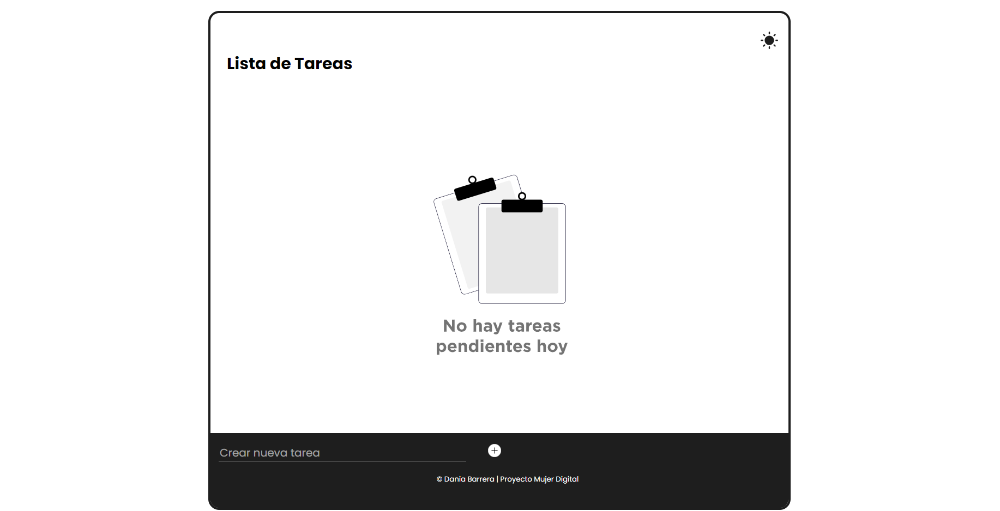

# Lista de Tareas

Una aplicación simple de lista de tareas para mantener un registro de tus tareas pendientes y mantenerte organizado.

## Características

- **Agregar tareas:** Agrega fácilmente nuevas tareas a tu lista.
- **Marcar como completadas:** Haz clic en la casilla de verificación para marcar una tarea como completada.
- **Vacía tu lista de tareas:** Cuando marques tu tarea como completada, se eliminará de tu lista. Además, el fondo de la aplicación cambia automáticamente si tienes tareas en tu lista o no.
- **Tema oscuro:** Cambia entre temas claro y oscuro según tu preferencia.
- **Almacenamiento local:** Las tareas se almacenan localmente en tu navegador para que no se pierdan después de cerrar la página.

## Uso

1. Escribe el nombre de una tarea en el campo de texto y presiona "Enter" o haz clic en el botón para agregarla a la lista.
2. Marca una tarea como completada haciendo clic en la casilla de verificación junto a ella.
3. Cambia entre el tema claro y oscuro haciendo clic en el botón de cambio de tema en la esquina superior derecha.
4. ¡Puedes añadir tareas, cerrar la página, y cuando vuelvas a abrirla tus tareas seguirán ahí! Y si no tienes tareas, estará listo para que añadas más.

## Tecnologías Utilizadas

- HTML
- CSS
- JavaScript
- Almacenamiento local en el navegador
- Google Fonts para la fuente "Poppins"

## Contribuir

Si deseas contribuir a este proyecto, ¡siéntete libre de hacerlo! Solo realiza un fork del repositorio, crea una nueva rama para tu trabajo y envía una solicitud de extracción cuando estés listo.

## Autor

Este proyecto fue desarrollado por Dania Celina Rosales Barrera, para la formación 'Intro a Coding' de Mujer Digital por Junior Achievement.

## Licencia

Este proyecto está bajo la Licencia MIT. Consulta el archivo [LICENSE](LICENSE) para obtener más detalles.
